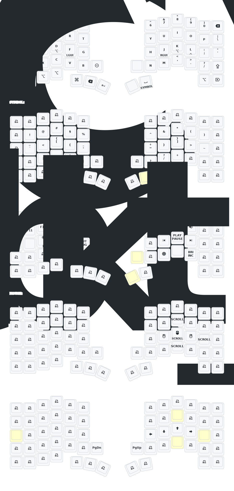

# Keyball61 ZMK Config

ZMK firmware configuration for the Keyball61 split keyboard with integrated trackball, targeting macOS.

## Features

- **Home row mods** (CAGS order) with cross-hand activation for macOS
- **Miryoku-inspired symbol layer** with brackets on home row
- **Auto-mouse layer** with trackball movement detection and configurable deadzone
- **Scroll layer** with arrow keys and page navigation

## Keymap

## Firmware Changes from Base Repo

This config diverges significantly from the original [Amos698](https://github.com/Amos698) base:

- **ZMK v0.3.0** — upgraded from v0.2 for module support and input processors
- **PMW3610 trackball driver** — switched to [kumamuk-git/zmk-pmw3610-driver](https://github.com/kumamuk-git/zmk-pmw3610-driver) with SPI configuration, input splitting, auto-mouse layer, scroll layer, and movement threshold tuning
- **OLED displays** — integrated [zmk-nice-oled](https://github.com/mctechnology17/zmk-nice-oled) module for vertical OLEDs with battery percentage, tuned sleep and performance settings
- **BLE optimization** — lower latency settings tuned for split keyboard communication
- **Zettaface ZMK fork** — temporarily used to fix input processor bugs (since reverted)

## Build

Firmware is built automatically via GitHub Actions on push to `main`. The keymap image above is also auto-generated by [keymap-drawer](https://github.com/caksoylar/keymap-drawer).

## Credits

PCB: *[yangxing844](https://github.com/yangxing844)*
Case: *[delock](https://github.com/delock)*
Firmware: *[Amos698](https://github.com/Amos698)*
